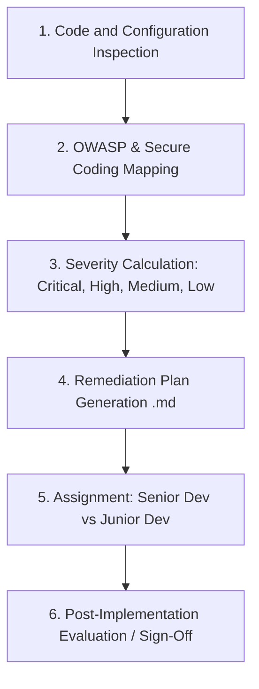

# Skill: Security Audit, Secure Coding, and Quality Gate (Security Specialist)

This skill guides the **Security Specialist (`@Seguranca` / `@Security`)** in conducting static and dynamic security reviews, drafting structured remediation plans, and performing ongoing post-development audits based on **OWASP Top 10**, **OWASP API Security Top 10**, and **Secure Coding** standards.

---

## 1. Operational Responsibilities and Activation Triggers

This skill should be activated during the following phases:
1. **Initial Architecture Audit**: Validation of data models, routes, authentication, and sensitive flows planned by the Architect.
2. **Post-Development Evaluation (Mandatory Security Gate)**: Following each implementation or batch of tasks completed by **Junior Dev** or **Senior Dev**, before code is considered ready.
3. **Vulnerability Detection and Remediation**: Generation of the detailed `.md` plan for programming agents to execute.

---

## 2. Audit and Code Inspection Methodology

When auditing new or existing code, strictly adhere to these 6 steps:

### Quick Code Inspection Checklist:
- [ ] **A01: Broken Access Control**: Is there identity and ownership validation across all endpoints? (IDOR/BOLA prevention).
- [ ] **A02: Cryptographic Failures**: Are secrets or passwords in plaintext? Does encryption use Argon2id/bcrypt? Are HTTPS/HSTS enforced?
- [ ] **A03: Injection**: Are there concatenated SQL queries, unsafe shell commands, or eval usage?
- [ ] **A04: Insecure Design**: Are request rate limits or lockout policies missing?
- [ ] **A05: Security Misconfiguration**: Permissive CORS (`*`)? Missing Helmet headers? Exposed stack traces?
- [ ] **A06: Vulnerabilities in Dependencies**: Known vulnerable dependencies added to `package.json` or equivalent?
- [ ] **A07: Identification & Auth Failures**: JWT without short expiration or refresh token without rotation? Sessions without `HttpOnly` and `Secure`?
- [ ] **A08: Software & Data Integrity Failures**: Arbitrary deserialization without validation?
- [ ] **A09: Logging & Monitoring Failures**: Sensitive data (passwords, cards, tokens) leaked into `console.log` or audit logs?
- [ ] **A10: SSRF**: Outbound URLs requested without domain allowlisting or private IP blocking?

---

## 3. Preparing the Remediation Plan (`security-plan.md`)

The Security Specialist never delivers findings without an actionable plan.
1. Use the template in `templates/security-audit-plan.template.md`.
2. For each flaw identified:
   - Explain the attack vector and potential business impact.
   - Provide vulnerable code snippet vs remediated code (*Secure Coding pattern*).
3. **Remediation Task Assignment**:
   - `[Dev Junior]`: Adding security headers, adjustments in Zod validation schemas (minimum field lengths, regex formats), log masking, enabling secure flags (`HttpOnly`, `SameSite`).
   - `[Dev Senior]`: Fixing architectural authentication/authorization flaws (RBAC/IDOR), complex query parameterization, implementing distributed rate limiters, cryptographic token rotation, and SSRF isolation.

---

## 4. Post-Development Security Gate Protocol

After developers state they have completed their tasks:
1. `@Seguranca` / `@Security` inspects the newly changed code (`diff`).
2. Verifies whether the remediation satisfied all stated acceptance criteria.
3. Ensures no new vulnerabilities were introduced as side effects.
4. **Gatekeeper Decision**:
   - **If an unmitigated critical/high issue remains**: The agent blocks approval and reports items requiring adjustment.
   - **If all fixes are approved**: The agent issues the **Security Sign-Off** with OWASP compliance stamp.
