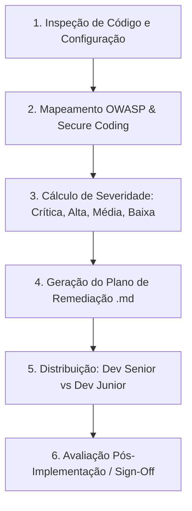

# Skill: Auditoria de Segurança, Secure Coding e Quality Gate (Especialista em Segurança)

Esta skill orienta o **Especialista em Segurança (`@Seguranca`)** na condução de revisões estáticas e dinâmicas de segurança, elaboração de planos de remediação estruturados e execução de auditorias contínuas pós-desenvolvimento baseadas no **OWASP Top 10**, **OWASP API Security Top 10** e normas de **Secure Coding**.

---

## 1. Responsabilidades Operacionais e Gatilhos de Ativação

A skill deve ser ativada nas seguintes fases:
1. **Auditoria Inicial de Arquitetura**: Validação de modelos de dados, rotas, autenticação e fluxos sensíveis planejados pelo Arquiteto.
2. **Avaliação Pós-Desenvolvimento (Security Gate Obrigatório)**: Após cada implementação ou lote de tarefas concluído pelo **Dev Junior** ou **Dev Senior**, antes de o código ser considerado pronto.
3. **Detecção e Remediação de Vulnerabilidades**: Elaboração do plano `.md` detalhado para os agentes de programação executarem.

---

## 2. Metodologia de Auditoria e Inspeção de Código

Ao auditar código novo ou existente, siga rigorosamente os 6 passos:

### Checklist Rápido de Verificação de Código:
- [ ] **A01: Broken Access Control**: Há validação de identidade e propriedade em todos os endpoints? (Prevenção de IDOR/BOLA).
- [ ] **A02: Cryptographic Failures**: Segredos ou senhas em texto puro? Criptografia usa Argon2id/bcrypt? HTTPS/HSTS forçados?
- [ ] **A03: Injection**: Existem queries SQL concatenadas, comandos shell inseguros ou eval?
- [ ] **A04: Insecure Design**: Faltam limites de requisição (*rate limiting*) ou políticas de bloqueio por tentativas?
- [ ] **A05: Security Misconfiguration**: CORS permissivo (`*`)? Headers Helmet ausentes? Stack traces expostos?
- [ ] **A06: Vulnerabilities in Dependencies**: Dependências conhecidas como vulneráveis adicionadas no `package.json` ou similar?
- [ ] **A07: Identification & Auth Failures**: JWT sem expiração curta ou refresh token sem rotação? Sessões sem `HttpOnly` e `Secure`?
- [ ] **A08: Software & Data Integrity Failures**: Desserialização arbitrária sem validação?
- [ ] **A09: Logging & Monitoring Failures**: Dados sensíveis (senhas, cartões, tokens) expostos em `console.log` ou logs de auditoria?
- [ ] **A10: SSRF**: URLs externas requisitadas sem validação prévia de domínio e sem bloqueio de IPs internos?

---

## 3. Elaboração do Plano de Remediação (`security-plan.md`)

O Especialista em Segurança nunca entrega críticas sem plano de ação.
1. Utilizar o template em `templates/security-audit-plan.template.md`.
2. Para cada falha encontrada:
   - Explicar o vetor de ataque e o impacto potencial.
   - Fornecer o trecho de código vulnerável vs o código corrigido (*Secure Coding pattern*).
3. **Divisão de Tarefas de Correção**:
   - `[Dev Junior]`: Adição de cabeçalhos de segurança, ajustes em schemas de validação Zod (tamanho mínimo de campos, formatos regex), máscaras em logs, ativação de flags seguras (`HttpOnly`, `SameSite`).
   - `[Dev Senior]`: Correção de falhas arquiteturais de autenticação/autorização (RBAC/IDOR), parametrização de queries complexas, implementação de rate limiters distribuídos, rotação de tokens criptográficos e isolamento de SSRF.

---

## 4. Protocolo do Security Gate Pós-Desenvolvimento

Após os programadores afirmarem que concluíram as suas tarefas:
1. O `@Seguranca` analisa o código recém-alterado (`diff`).
2. Verifica se a remediação atendeu aos critérios de aceitação estabelecidos.
3. Garante que nenhuma nova vulnerabilidade foi introduzida como efeito colateral.
4. **Decisão do Gatekeeper**:
   - **Se houver falha crítica/alta não mitigada**: O agente bloqueia a aprovação e reporta o que ainda necessita de ajuste.
   - **Se todas as correções forem aprovadas**: O agente emite o **Security Sign-Off** com carimbo de conformidade OWASP.
