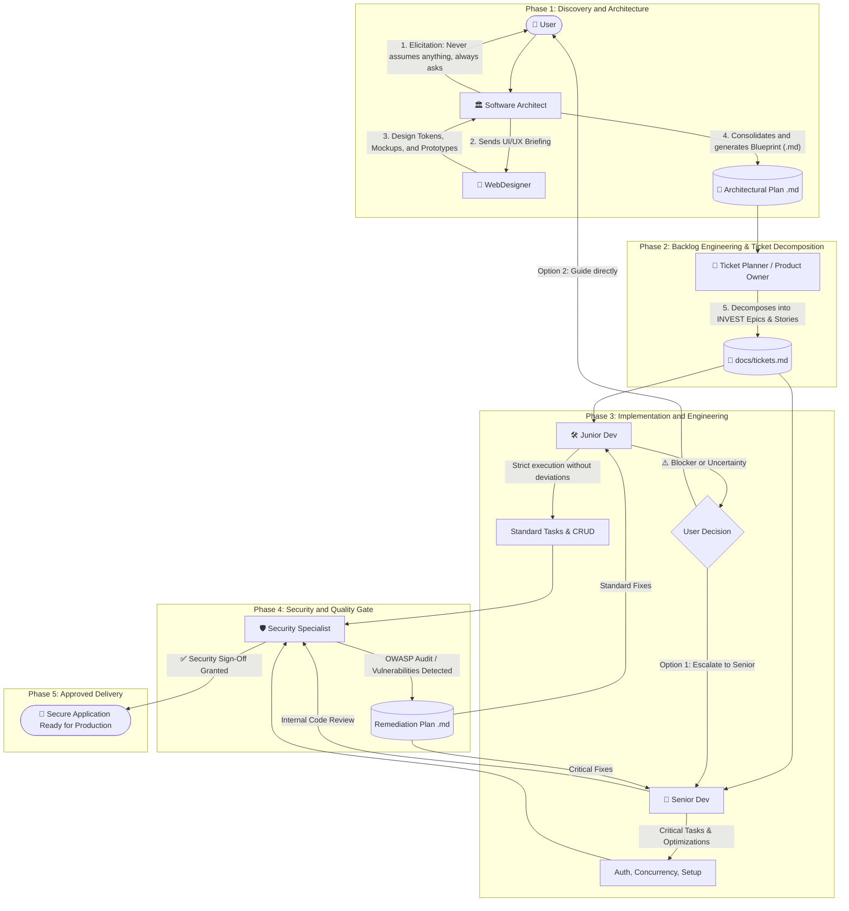

# 🤖 Full-Stack Software Engineering Multi-Agent Ecosystem

A complete ecosystem of intelligent agents and skills designed to lead the end-to-end development cycle of applications with a robust **Backend** and visual excellence (UI/UX) in the **Frontend**.

---

## 🌟 Multi-Agent Architecture Overview

The ecosystem divides responsibilities into specialized and complementary roles, ensuring that no technical decision is made blindly, execution is disciplined, and every line of code is validated against global security standards:

---

## 👥 The 6 Specialized Agents

### 1. 🏛️ Software Architect (`@Arquiteto` / `@Architect`)
- **Role**: Cross-cutting architecture planning, justified tech stack selection, API contracts, and data models.
- **Golden Rule**: **NEVER ASSUME ANY INFORMATION**. If any functional or non-functional requirement is missing, always ask the user before deciding.
- **Frontend & Backend**: Incorporates core UI/UX principles on the frontend and Clean Architecture patterns on the backend.
- **Collaboration**: Engages the WebDesigner to create visual mockups prior to drafting the frontend plan.
- **Deliverable**: Generates the plan in `.md` format (using the template in `templates/architecture-plan.template.md`).
- **Full Definition**: [.agents/personas/arquiteto.md](file:///.agents/personas/arquiteto.md)

### 2. 🎨 WebDesigner (`@WebDesigner`)
- **Role**: Creation of cutting-edge visual identities, design tokens, and high-fidelity prototypes.
- **Aesthetics & Trends**: Applies contemporary visual trends (Bento Grids, tactile surfaces, Slate/Zinc Dark Mode, vibrant indigo/cyan accents, fluid micro-interactions).
- **Usability (UX)**: Ensures compliance with Nielsen's Heuristics, WCAG 2.1 AA accessibility (minimum 4.5:1 contrast), and touch targets >= 44x44px.
- **Tools**: HTML/CSS prototyping and visual asset/mockup generation using `generate_image`.
- **Full Definition**: [.agents/personas/web-designer.md](file:///.agents/personas/web-designer.md)

### 3. 🎫 Ticket Planner & Product Owner (`@TicketPlanner` / `@ProductOwner` / `@Tickets`)
- **Role**: Backlog architecture, decomposition of architectural blueprints into Epics and User/Technical Stories following agile best practices.
- **Agile Heuristics**: Strict enforcement of **INVEST** principles, BDD/Gherkin acceptance criteria (`Given-When-Then`), Fibonacci estimation (Story Points), explicit dependencies, and role assignment.
- **Deliverable**: Compiles and writes the backlog to `docs/tickets.md` (using `templates/tickets.template.md`).
- **Full Definition**: [.agents/personas/ticket-planner.md](file:///.agents/personas/ticket-planner.md)

### 4. 🛠️ Junior Dev (`@DevJunior`)
- **Role**: Systematic and faithful implementation of assigned tasks in the `.md` plan or `docs/tickets.md`.
- **Golden Rule**: **ZERO DEVIATIONS AND ZERO INVENTIONS**. Strictly follows the plan without changing libraries, endpoints, schemas, or visual tokens.
- **Blocker Protocol**: When encountering any persistent error, incompatibility, or ambiguity that cannot be resolved, **stops the task** and asks the user whether to escalate to the **Senior Dev** or guide directly.
- **Full Definition**: [.agents/personas/dev-junior.md](file:///.agents/personas/dev-junior.md)

### 5. 🚀 Senior Dev (`@DevSenior`)
- **Role**: Advanced engineering with decades of hands-on experience.
- **Technical Autonomy**: Follows the Architect's plan and security recommendations, but has the autonomy to adopt superior, more efficient solutions when identifying optimization opportunities (documenting the technical rationale).
- **Mentoring and Resolution**: Takes on complex tasks (authentication, concurrency, distributed transactions, database performance, critical security remediations) and unblocks the Junior Dev.
- **Full Definition**: [.agents/personas/dev-senior.md](file:///.agents/personas/dev-senior.md)

### 6. 🛡️ Security Specialist (`@Seguranca` / `@Security`)
- **Role**: Continuous security auditing, rigorous vulnerability identification, and guardian of **Secure Coding** and **OWASP** standards.
- **Post-Development Security Quality Gate**: Inspects code after every implementation cycle by developers (`Junior Dev` and `Senior Dev`), evaluating authentication flaws, injections, misconfigurations, and access controls.
- **Remediation Plan**: Produces a detailed plan in `.md` format (using the template in `templates/security-audit-plan.template.md`), categorizing tasks by severity and assigning them to `[Dev Junior]` or `[Dev Senior]`.
- **Security Sign-Off**: Issues formal approval only after all critical/high vulnerabilities are resolved.
- **Full Definition**: [.agents/personas/seguranca.md](file:///.agents/personas/seguranca.md)

---

## 🧰 Specialized Skills

Skills are located in `.agents/skills/` and are triggered as needed:

| Skill | Location | Purpose |
| :--- | :--- | :--- |
| **`architect-planner`** | [.agents/skills/architect-planner/SKILL.md](file:///.agents/skills/architect-planner/SKILL.md) | Requirement elicitation without assumptions, stack tradeoff analysis, and `.md` blueprint generation. |
| **`ticket-planner`** | [.agents/skills/ticket-planner/SKILL.md](file:///.agents/skills/ticket-planner/SKILL.md) | Architectural plan deconstruction into Epics and INVEST Stories with BDD/Gherkin acceptance criteria, Story Points, and `docs/tickets.md` generation. |
| **`webdesigner-uiux`** | [.agents/skills/webdesigner-uiux/SKILL.md](file:///.agents/skills/webdesigner-uiux/SKILL.md) | Creation of CSS Design Tokens, Bento Grid layouts, interactive prototypes, and WCAG accessibility auditing. |
| **`junior-developer`** | [.agents/skills/junior-developer/SKILL.md](file:///.agents/skills/junior-developer/SKILL.md) | Disciplined ticket execution, pre-completion validation, and escalation protocol issuance. |
| **`senior-developer`** | [.agents/skills/senior-developer/SKILL.md](file:///.agents/skills/senior-developer/SKILL.md) | Architectural optimization, root-cause resolution of blockers, clean refactoring, and profiling. |
| **`security-specialist`** | [.agents/skills/security-specialist/SKILL.md](file:///.agents/skills/security-specialist/SKILL.md) | Source code security audit, OWASP/Secure Coding mapping, remediation plan generation, and post-development Security Gate. |
| **`fullstack-standards`** | [.agents/skills/fullstack-standards/SKILL.md](file:///.agents/skills/fullstack-standards/SKILL.md) | Canonical API response envelope templates, Zod validation, repositories, and typed components. |

---

## 📜 Best Practice Rules (Automatically Injected)

All agents adhere to centralized rules in `.agents/rules/`:
1. 🎫 **[ticket-creation-standards.md](file:///.agents/rules/ticket-creation-standards.md)**:
   - INVEST criteria, Story Point Fibonacci sizing (1, 2, 3, 5, 8).
   - BDD/Gherkin acceptance criteria (`Given-When-Then`), Definition of Ready (DoR), and Definition of Done (DoD).
   - Explicit agent role assignment (`[Dev Junior]`, `[Dev Senior]`, `[WebDesigner]`, `[Security]`).
2. 🎨 **[ui-ux-best-practices.md](file:///.agents/rules/ui-ux-best-practices.md)**:
   - Usability Heuristics (Nielsen Norman).
   - 60-30-10 palette, Dark Mode without pure black (`#000000`), micro-interactions (150-250ms).
   - Specification of the 6 mandatory component states (Default, Hover, Active, Focus, Disabled, Loading).
3. ⚙️ **[fullstack-engineering-standards.md](file:///.agents/rules/fullstack-engineering-standards.md)**:
   - Layered Architecture (Controller -> Service -> Repository -> Entity).
   - RESTful APIs with semantic HTTP statuses and `{ success, data, meta }` / `{ success, error }` envelopes.
   - Data sanitization, referential integrity, and atomic transactions.
4. 🛡️ **[secure-coding-and-owasp.md](file:///.agents/rules/secure-coding-and-owasp.md)**:
   - OWASP Top 10 and API Security Top 10 standards.
   - Hashing with Argon2id/bcrypt, HttpOnly/Secure/SameSite cookies, rotating tokens.
   - Helmet headers, anti-CSRF protection, restrictive CORS, and SSRF/IDOR/BOLA prevention.
5. 🧹 **[clean-code-and-architecture.md](file:///.agents/rules/clean-code-and-architecture.md)**:
   - Intention-revealing naming, small single-responsibility functions.
   - SOLID, KISS, DRY, and YAGNI principles.
   - Strict TypeScript typing (no `any`).
6. 🤝 **[agent-collaboration-protocol.md](file:///.agents/rules/agent-collaboration-protocol.md)**:
   - Communication workflows, formal handoff across the 6 agents, and Security Gate protocol.

---

## 📁 Available Models and Templates (`templates/`)

- [architecture-plan.template.md](file:///templates/architecture-plan.template.md): The blueprint that the Architect fills and delivers.
- [tickets.template.md](file:///templates/tickets.template.md): The agile Epics and Stories backlog template filled by the Ticket Planner.
- [security-audit-plan.template.md](file:///templates/security-audit-plan.template.md): The audit and remediation plan generated by the Security Specialist.
- [escalation-ticket.template.md](file:///templates/escalation-ticket.template.md): The format used by the Junior Dev when encountering a blocker.
- [design-tokens.template.css](file:///templates/design-tokens.template.css): The initial stylesheet with modern CSS variables.
- [design-brief.template.md](file:///templates/design-brief.template.md): The Architect's briefing to the WebDesigner.

---

## 🚀 How to Start a Project with this Ecosystem

1. **Activate the Architect**:
   > *"@Arquiteto, I want to build an application for [describe business idea]."*
2. **Answer Alignment Questions**:
   - The Architect **will not start coding** right away. They will present structured questions regarding stack, scale, authentication, and preferences.
3. **Mockup Creation**:
   - The Architect will summon the **@WebDesigner** to generate design tokens and UI mockups.
4. **Plan Generation**:
   - The Architect will produce the `plan.md` file with architectural contracts and task phases.
5. **Backlog & Ticket Generation**:
   - The **@TicketPlanner** analyzes the plan and generates `docs/tickets.md`, deconstructing the architecture into Epics, INVEST User Stories, BDD acceptance criteria, and role assignments.
6. **Iterative Development**:
   - The **Senior Dev** establishes foundations and authentication systems.
   - The **Junior Dev** executes CRUDs and visual components from the backlog.
   - If the Junior Dev gets blocked, they will ask whether to escalate to the Senior Dev or guide directly.
7. **Continuous Security Evaluation (`@Seguranca`)**:
   - After each developer development cycle, the **Security Specialist** audits code against OWASP and Secure Coding standards.
   - If gaps are found, they generate `security-plan.md` with prioritized tasks for developers.
   - When the code is 100% secure, they issue the **Security Sign-Off** for acceptance and delivery.

---

## 💻 Multi-Platform Compatibility (Codex, Claude, Cursor, Gemini)

This ecosystem is ready for out-of-the-box use across the major AI coding environments:

| Platform / Tool | Native Config File | How to Use |
|---|---|---|
| **Cursor** | [.cursorrules](file:///.cursorrules) | Tag `@Architect`, `@WebDesigner`, `@TicketPlanner`, `@DevJunior`, `@DevSenior`, `@Security` in Chat, Composer, or Agent mode. |
| **Claude / Claude Code** | [CLAUDE.md](file:///CLAUDE.md) | Automatically loaded by Claude Code CLI and Claude Projects. Mention desired role in prompts. |
| **OpenAI Codex / Copilot** | [CODEX.md](file:///CODEX.md), [.github/copilot-instructions.md](file:///.github/copilot-instructions.md) | Automatically injected in OpenAI Codex sessions and GitHub Copilot chats. |
| **Gemini / Antigravity** | [GEMINI.md](file:///GEMINI.md), [AGENTS.md](file:///AGENTS.md) | Native discovery via `.agents/personas/`, `.agents/rules/`, and `.agents/skills/`. |

