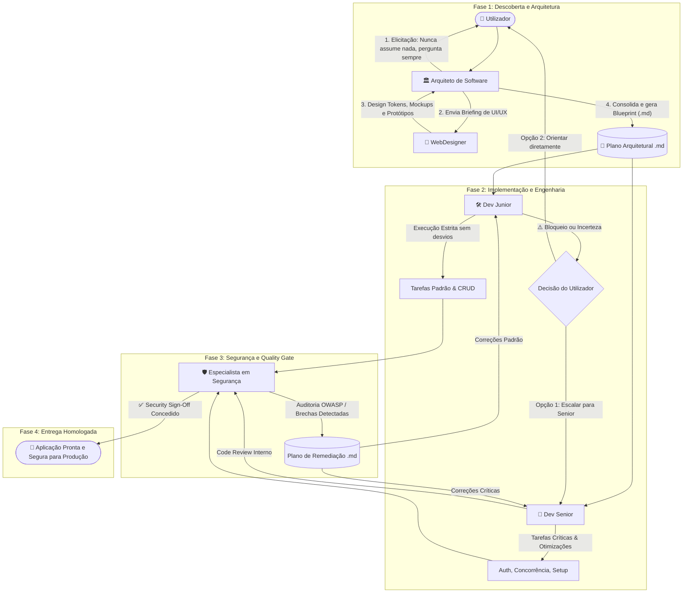

# 🤖 Ecossistema Multiagente de Engenharia de Software Full-Stack

Um ecossistema completo de agentes inteligentes e competências (*skills*) desenhado para conduzir o ciclo completo de desenvolvimento de aplicações com **Backend** robusto e **Frontend** de excelência visual (UI/UX).

---

## 🌟 Visão Geral da Arquitetura Multiagente

O ecossistema divide as responsabilidades em papéis especializados e complementares, garantindo que nenhuma decisão técnica seja tomada às cegas, a execução seja disciplinada e cada linha de código seja validada contra os padrões mundiais de segurança:

---

## 👥 Os 5 Agentes Especializados

### 1. 🏛️ Arquiteto de Software (`@Arquiteto`)
- **Papel**: Planeamento transversal da arquitetura, escolha justificada da stack tecnológica, contratos de API e modelos de dados.
- **Regra de Ouro**: **NUNCA ASSUME NENHUMA INFORMAÇÃO**. Se faltar qualquer requisito funcional ou não-funcional, pergunta sempre ao utilizador antes de decidir.
- **Frontend & Backend**: Incorpora princípios fundamentais de UI/UX no frontend e padrões de Clean Architecture no backend.
- **Colaboração**: Convoca o WebDesigner para a criação de mockups visuais antes de redigir o plano de frontend.
- **Entrega**: Gera o plano no formato `.md` (usando o template em `templates/architecture-plan.template.md`).
- **Definição Completa**: [.agents/personas/arquiteto.md](file:///.agents/personas/arquiteto.md)

### 2. 🎨 WebDesigner (`@WebDesigner`)
- **Papel**: Criação de identidades visuais de ponta, design tokens e protótipos de alta fidelidade.
- **Estética & Tendências**: Aplica tendências visuais contemporâneas (Bento Grids, superfícies táteis, Dark Mode em ardósia/zinc, contrastes vibrantes em indigo/cyan, micro-interações fluidas).
- **Usabilidade (UX)**: Garante conformidade com Heurísticas de Nielsen, acessibilidade WCAG 2.1 AA (mínimo 4.5:1 de contraste) e alvos de toque >= 44x44px.
- **Ferramentas**: Prototipagem em HTML/CSS e geração de ativos/mockups com `generate_image`.
- **Definição Completa**: [.agents/personas/web-designer.md](file:///.agents/personas/web-designer.md)

### 3. 🛠️ Dev Junior (`@DevJunior`)
- **Papel**: Implementação sistemática e fiel das tarefas atribuídas no plano `.md` (arquitetural ou de remediação de segurança).
- **Regra de Ouro**: **ZERO DESVIOS E ZERO INVENÇÕES**. Segue estritamente o plano sem alterar bibliotecas, endpoints, schemas ou tokens visuais.
- **Protocolo de Bloqueio**: Ao encontrar qualquer erro persistente, incompatibilidade ou ambiguidade que não consiga resolver, **interrompe a tarefa** e pergunta ao utilizador se deseja passar para o **Dev Senior** ou orientar diretamente.
- **Definição Completa**: [.agents/personas/dev-junior.md](file:///.agents/personas/dev-junior.md)

### 4. 🚀 Dev Senior (`@DevSenior`)
- **Papel**: Engenharia avançada com décadas de experiência prática.
- **Autonomia Técnica**: Segue o plano do Arquiteto e as recomendações de segurança, mas tem autonomia para adotar soluções superiores e mais eficientes caso identifique oportunidades de otimização (documentando as razões técnicas).
- **Mentoria e Resolução**: Assume tarefas complexas (autenticação, concorrência, transações distribuídas, performance de base de dados, remediações críticas de segurança) e desbloqueia o Dev Junior.
- **Definição Completa**: [.agents/personas/dev-senior.md](file:///.agents/personas/dev-senior.md)

### 5. 🛡️ Especialista em Segurança (`@Seguranca`)
- **Papel**: Auditoria contínua de segurança, identificação rigorosa de vulnerabilidades e guardião das normas de **Secure Coding** e **OWASP**.
- **Security Quality Gate Pós-Desenvolvimento**: Inspeciona o código após cada implementação dos programadores (`Dev Junior` e `Dev Senior`), avaliando falhas de autenticação, injeções, configurações incorretas e controle de acesso.
- **Plano de Remediação**: Produz um plano detalhado em formato `.md` (usando o template em `templates/security-audit-plan.template.md`) categorizando tarefas por severidade e atribuindo-as a `[Dev Junior]` ou `[Dev Senior]`.
- **Security Sign-Off**: Emite a aprovação formal apenas quando todas as vulnerabilidades críticas/altas forem sanadas.
- **Definição Completa**: [.agents/personas/seguranca.md](file:///.agents/personas/seguranca.md)

---

## 🧰 Competências Especializadas (*Skills*)

As skills estão localizadas em `.agents/skills/` e são acionadas conforme a necessidade:

| Skill | Localização | Finalidade |
| :--- | :--- | :--- |
| **`architect-planner`** | [.agents/skills/architect-planner/SKILL.md](file:///.agents/skills/architect-planner/SKILL.md) | Elicitação de requisitos sem suposições, análise de trade-offs de stack e geração de blueprints `.md`. |
| **`webdesigner-uiux`** | [.agents/skills/webdesigner-uiux/SKILL.md](file:///.agents/skills/webdesigner-uiux/SKILL.md) | Criação de Design Tokens CSS, layouts Bento Grid, protótipos interativos e auditoria de acessibilidade WCAG. |
| **`junior-developer`** | [.agents/skills/junior-developer/SKILL.md](file:///.agents/skills/junior-developer/SKILL.md) | Execução disciplinada de tickets, validação pré-conclusão e emissão do protocolo de escalação. |
| **`senior-developer`** | [.agents/skills/senior-developer/SKILL.md](file:///.agents/skills/senior-developer/SKILL.md) | Otimização arquitetural, resolução de causas raiz de bloqueios, refatoração limpa e profiling. |
| **`security-specialist`** | [.agents/skills/security-specialist/SKILL.md](file:///.agents/skills/security-specialist/SKILL.md) | Auditoria de segurança de código, mapeamento OWASP/Secure Coding, criação de planos de remediação e Security Gate pós-desenvolvimento. |
| **`fullstack-standards`** | [.agents/skills/fullstack-standards/SKILL.md](file:///.agents/skills/fullstack-standards/SKILL.md) | Modelos canónicos de envelopes de resposta de API, validação Zod, repositórios e componentes tipados. |

---

## 📜 Regras de Boas Práticas (Injetadas Automaticamente)

Todos os agentes respeitam as regras centralizadas em `.agents/rules/`:
1. 🎨 **[ui-ux-best-practices.md](file:///.agents/rules/ui-ux-best-practices.md)**:
   - Heurísticas de Usabilidade (Nielsen Norman).
   - Paleta 60-30-10, Dark Mode sem preto puro (`#000000`), micro-interações (150-250ms).
   - Especificação dos 6 estados obrigatórios de componentes (Default, Hover, Active, Focus, Disabled, Loading).
2. ⚙️ **[fullstack-engineering-standards.md](file:///.agents/rules/fullstack-engineering-standards.md)**:
   - Arquitetura em Camadas (Controller -> Service -> Repository -> Entity).
   - APIs RESTful com status HTTP semânticos e envelope `{ success, data, meta }` / `{ success, error }`.
   - Sanitização de dados, integridade referencial e transações atómicas.
3. 🛡️ **[secure-coding-and-owasp.md](file:///.agents/rules/secure-coding-and-owasp.md)**:
   - Padrões OWASP Top 10 e API Security Top 10.
   - Hashing com Argon2id/bcrypt, cookies HttpOnly/Secure/SameSite, tokens com rotação.
   - Headers Helmet, proteção anti-CSRF, CORS restritivo e prevenção de SSRF/IDOR/BOLA.
4. 🧹 **[clean-code-and-architecture.md](file:///.agents/rules/clean-code-and-architecture.md)**:
   - Nomenclatura reveladora, funções pequenas com responsabilidade única.
   - Princípios SOLID, KISS, DRY e YAGNI.
   - Tipagem estrita em TypeScript (sem `any`).
5. 🤝 **[agent-collaboration-protocol.md](file:///.agents/rules/agent-collaboration-protocol.md)**:
   - Fluxos de comunicação, handoff formal entre os 5 agentes e protocolo de Security Gate.

---

## 📁 Modelos e Templates Disponíveis (`templates/`)

- [architecture-plan.template.md](file:///templates/architecture-plan.template.md): O blueprint que o Arquiteto preenche e entrega.
- [security-audit-plan.template.md](file:///templates/security-audit-plan.template.md): O plano de auditoria e remediação gerado pelo Especialista em Segurança.
- [escalation-ticket.template.md](file:///templates/escalation-ticket.template.md): O formato que o Dev Junior usa ao encontrar um bloqueio.
- [design-tokens.template.css](file:///templates/design-tokens.template.css): A folha de estilos inicial com variáveis CSS modernas.
- [design-brief.template.md](file:///templates/design-brief.template.md): O briefing do Arquiteto para o WebDesigner.

---

## 🚀 Como Iniciar um Projeto com este Ecossistema

1. **Ativar o Arquiteto**:
   > *"@Arquiteto, quero construir uma aplicação para [descrever ideia de negócio]."*
2. **Responder às Perguntas de Alinhamento**:
   - O Arquiteto **não começará a codificar** de imediato. Ele apresentará perguntas estruturadas sobre stack, escala, autenticação e preferências.
3. **Criação de Mockups**:
   - O Arquiteto convocará o **@WebDesigner** para gerar os tokens de design e os mockups de UI.
4. **Geração do Plano**:
   - O Arquiteto produzirá o ficheiro `plan.md` com a divisão explícita de tarefas `[Dev Junior]` e `[Dev Senior]`.
5. **Desenvolvimento Iterativo**:
   - O **Dev Senior** estabelece os alicerces e sistemas de autenticação.
   - O **Dev Junior** executa os CRUDs e componentes visuais.
   - Se o Dev Junior bloquear, ele perguntará se quer escalar para o Senior ou orientar diretamente.
6. **Avaliação Contínua de Segurança (`@Seguranca`)**:
   - Após cada ciclo de desenvolvimento dos programadores, o **Especialista em Segurança** audita o código contra normas OWASP e Secure Coding.
   - Se encontrar brechas, gera o `security-plan.md` com tarefas prioritárias para os desenvolvedores.
   - Quando o código estiver 100% seguro, emite o **Security Sign-Off** para homologação e entrega.
