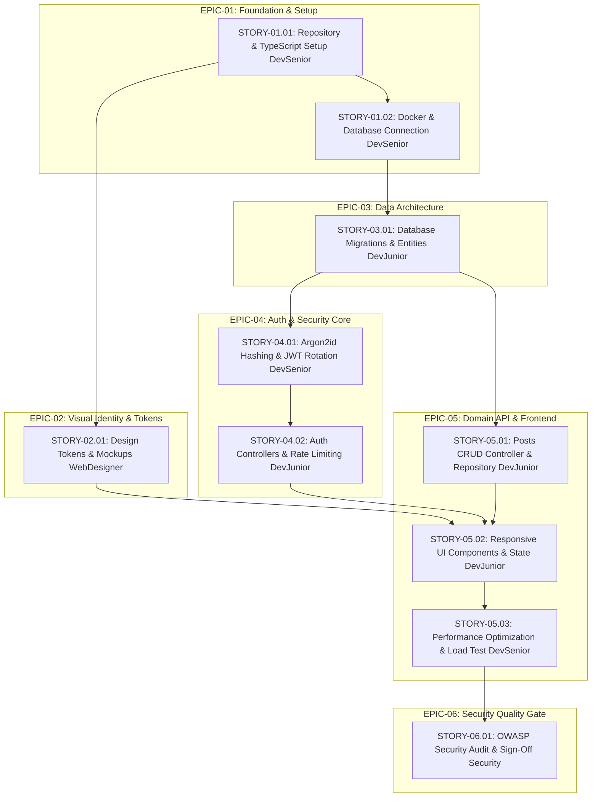

# Development Backlog & Tickets: Full-Stack Web Application

> **Author**: 🎫 Ticket Planner & Product Owner (`@TicketPlanner` / `@ProductOwner` / `@Tickets`)  
> **Source Blueprint**: [templates/architecture-plan.template.md](file:///templates/architecture-plan.template.md) / [docs/architecture-plan.md](file:///docs/architecture-plan.md)  
> **Creation Date**: 2026-09-28  
> **Status**: Ready for Sprint Execution  
> **Execution Roles**: 🛠️ Junior Dev, 🚀 Senior Dev, 🎨 WebDesigner, 🛡️ Security Specialist  

---

## 1. Backlog Executive Summary & Metrics

### 1.1 Sprint Capacity & Distribution

| Metric | Target Value |
| :--- | :--- |
| **Total Epics** | 6 Epics |
| **Total Development Stories** | 10 Stories |
| **Total Story Points (SP)** | 35 SP (Fibonacci Scale) |
| **Assigned to `[Dev Senior]`** | 4 Stories (18 SP - 51.4%) |
| **Assigned to `[Dev Junior]`** | 4 Stories (11 SP - 31.4%) |
| **Assigned to `[WebDesigner]`** | 1 Story (3 SP - 8.6%) |
| **Assigned to `[Security / Segurança]`** | 1 Story (3 SP - 8.6%) |

### 1.2 Backlog Dependency Flow (Mermaid)



---

## 2. Epics Catalog

### EPIC-01: Foundation, Infrastructure & Core Setup
- **Objective**: Establish the enterprise-grade project foundations, strictly typed development environment, Docker database provisioning, and health monitoring.
- **Architecture Reference**: Section 1 & Section 2 of [architecture-plan.template.md](file:///templates/architecture-plan.template.md)
- **Scope**:
  - **In-Scope**: Node.js/TypeScript configuration, ESLint/Prettier, folder structure (Clean Architecture), Docker Compose for PostgreSQL, connection pooling, and healthcheck route.
  - **Out-of-Scope**: Domain business logic and UI component styling.
- **Child Stories**: `STORY-01.01`, `STORY-01.02`
- **Epic Definition of Done (DoD)**:
  - Repository builds with zero TypeScript errors.
  - Database container starts smoothly and migrations run on startup.
  - `GET /health` endpoint responds with HTTP 200 OK.

---

### EPIC-02: Design Tokens & Visual Identity System
- **Objective**: Craft the modern visual identity, HSL color tokens, typography scales, accessibility contrasts (WCAG 2.1 AA), and interactive mockup prototypes.
- **Architecture Reference**: Section 5 of [architecture-plan.template.md](file:///templates/architecture-plan.template.md)
- **Scope**:
  - **In-Scope**: `design-tokens.css` with 60-30-10 palette (Slate/Zinc Dark Mode with Indigo accent), typography imports, component states, and HTML prototype.
  - **Out-of-Scope**: React/Vite component implementation (handled in Epic 5).
- **Child Stories**: `STORY-02.01`
- **Epic Definition of Done (DoD)**:
  - Design tokens validated against WCAG 2.1 AA with >= 4.5:1 text contrast.
  - Interactive mockup showcases responsive layout and component micro-interactions (150-250ms).

---

### EPIC-03: Data Architecture & Persistence Layer
- **Objective**: Model relational schemas, execute database migrations, apply indexed queries, and create typed domain entity definitions.
- **Architecture Reference**: Section 3 of [architecture-plan.template.md](file:///templates/architecture-plan.template.md)
- **Scope**:
  - **In-Scope**: `users` and `posts` tables, foreign keys, timestamps, unique and composite indexes.
  - **Out-of-Scope**: HTTP Controller endpoints.
- **Child Stories**: `STORY-03.01`
- **Epic Definition of Done (DoD)**:
  - Migration script executes forward (`up`) and backward (`down`) idempotently.
  - Domain entities exported with strict TypeScript interfaces.

---

### EPIC-04: Authentication, Cryptography & Session Security
- **Objective**: Implement cryptographic credential security, JWT issuance with rotating refresh tokens, HttpOnly cookies, and authentication middleware.
- **Architecture Reference**: Section 2 & Section 4 of [architecture-plan.template.md](file:///templates/architecture-plan.template.md)
- **Scope**:
  - **In-Scope**: Argon2id hashing, access/refresh token rotation, rate-limiting on auth endpoints, and authentication middleware.
  - **Out-of-Scope**: Social login (OAuth) or SSO.
- **Child Stories**: `STORY-04.01`, `STORY-04.02`
- **Epic Definition of Done (DoD)**:
  - Automated tests achieve > 90% coverage on authentication pathways.
  - Refresh tokens stored securely in HttpOnly, SameSite=Strict cookies.

---

### EPIC-05: Domain Business Logic, RESTful APIs & Frontend UI
- **Objective**: Deliver the core Posts CRUD features, input validation with Zod, typed repository pattern, and reactive UI components consuming the API.
- **Architecture Reference**: Section 4 & Section 5 of [architecture-plan.template.md](file:///templates/architecture-plan.template.md)
- **Scope**:
  - **In-Scope**: RESTful endpoints with standardized envelope (`{ success, data, meta }`), Zod validation schemas, responsive UI cards and forms with skeletons.
  - **Out-of-Scope**: Third-party payment gateways or external integrations.
- **Child Stories**: `STORY-05.01`, `STORY-05.02`, `STORY-05.03`
- **Epic Definition of Done (DoD)**:
  - All API routes conform strictly to documented request/response envelopes.
  - UI renders smoothly across mobile and desktop breakpoints with shimmer loading states.

---

### EPIC-06: Security Quality Gate & OWASP Compliance
- **Objective**: Execute continuous vulnerability auditing, threat modeling, and issue formal Security Sign-Off prior to release.
- **Architecture Reference**: Section 6 (Phase 8) of [architecture-plan.template.md](file:///templates/architecture-plan.template.md)
- **Scope**:
  - **In-Scope**: SAST code audit, OWASP Top 10 and API Security verification, security report generation.
  - **Out-of-Scope**: Infrastructure penetration testing.
- **Child Stories**: `STORY-06.01`
- **Epic Definition of Done (DoD)**:
  - Zero Critical and High vulnerabilities remain open in the codebase.
  - Security Specialist grants official Security Sign-Off.

---

## 3. Development Stories Catalog

### STORY-01.01: Repository Architecture, Tooling & Healthcheck
- **Epic**: EPIC-01 - Foundation, Infrastructure & Core Setup
- **Type**: Technical Enabler
- **Assigned Agent**: `[Dev Senior]`
- **Priority**: P0 (Blocker)
- **Estimation**: 5 SP (Size: M)
- **Dependencies**:
  - Blocked by: None
  - Blocks: `STORY-01.02`, `STORY-02.01`, `STORY-03.01`

#### 1. Narrative
**As a** lead software engineer  
**I need** to establish a clean, strictly typed modular architecture with TypeScript, ESLint, Prettier, and environment variable schema validation  
**So that** all developers can write robust, decoupled code adhering to Clean Architecture standards.

#### 2. Technical Context & Scope
- **Target Files**:
  - `package.json` (Create)
  - `tsconfig.json` (Create with `strict: true`, `target: ES2022`, module resolution NodeNext)
  - `src/config/env.ts` (Create with Zod runtime validation)
  - `src/server.ts` (Create entrypoint)
  - `src/api/routes/health.routes.ts` (Create `GET /health`)
- **Standards**: Layered architecture (`api/`, `domain/`, `infrastructure/`, `services/`).

#### 3. Acceptance Criteria (BDD / Gherkin)
```gherkin
Scenario: Server boots and responds to healthcheck
  Given the application dependencies are installed
  When the server process is started via `npm run dev`
  And a client performs a `GET /health` request
  Then the response status must be 200 OK
  And the JSON body must match:
    """
    {
      "success": true,
      "data": {
        "status": "healthy",
        "timestamp": "<ISO-STRING>"
      }
    }
    """

Scenario: Invalid environment variables prevent boot
  Given a required environment variable (e.g., `PORT` or `DATABASE_URL`) is missing
  When the server process boots
  Then the application must terminate with a descriptive Zod validation error log
  And exit with non-zero code
```

#### 4. Verification Checklist
- [ ] TypeScript strict mode enabled with path aliases (`@/*`).
- [ ] Linter script configured with zero warnings.
- [ ] Standardized JSON envelope applied on health route.
- [ ] Graceful shutdown hooks implemented on `SIGTERM` and `SIGINT`.

---

### STORY-01.02: Docker Compose & PostgreSQL Connection Pool
- **Epic**: EPIC-01 - Foundation, Infrastructure & Core Setup
- **Type**: Technical Enabler
- **Assigned Agent**: `[Dev Senior]`
- **Priority**: P0 (Blocker)
- **Estimation**: 3 SP (Size: S)
- **Dependencies**:
  - Blocked by: `STORY-01.01`
  - Blocks: `STORY-03.01`

#### 1. Narrative
**As a** backend developer  
**I need** automated containerized PostgreSQL provisioning and a resilient database connection pool  
**So that** persistent application data can be queried with low latency and automatic reconnection.

#### 2. Technical Context & Scope
- **Target Files**:
  - `docker-compose.yml` (PostgreSQL 16 Alpine + healthcheck)
  - `.env.example` (PostgreSQL connection strings)
  - `src/infrastructure/database/client.ts` (Connection pooling with retry logic)

#### 3. Acceptance Criteria (BDD / Gherkin)
```gherkin
Scenario: Automated database container startup
  Given Docker daemon is running
  When the engineer executes `docker compose up -d`
  Then the PostgreSQL service becomes healthy within 15 seconds
  And accepts incoming connections on port 5432
```

#### 4. Verification Checklist
- [ ] Connection pool configured with sensible limits (max 20 connections).
- [ ] Database credentials loaded strictly from validated environment variables.
- [ ] Automatic reconnection retry with exponential backoff on connection drops.

---

### STORY-02.01: CSS Design Tokens & Visual Mockup System
- **Epic**: EPIC-02 - Design Tokens & Visual Identity System
- **Type**: User Story
- **Assigned Agent**: `[WebDesigner]`
- **Priority**: P1 (High)
- **Estimation**: 3 SP (Size: S)
- **Dependencies**:
  - Blocked by: `STORY-01.01`
  - Blocks: `STORY-05.02`

#### 1. Narrative
**As a** product user  
**I want** a polished, tactile dark-mode interface with harmonious colors, readable typography, and smooth micro-interactions  
**So that** I have an engaging, accessible, and delightful visual experience.

#### 2. Technical Context & Scope
- **Target Files**:
  - `src/styles/design-tokens.css` (Create `:root` CSS variables)
  - `mockups/prototype.html` (Interactive HTML/CSS mockup showcasing states)
- **Tokens to Define**:
  - Backgrounds: `--bg-primary` (#0B0F19), `--bg-surface` (#111827), `--bg-card` (#1F2937)
  - Accents: `--accent-primary` (#6366F1), `--accent-hover` (#4F46E5)
  - Text: `--text-primary` (#F9FAFB), `--text-secondary` (#9CA3AF)
  - Radii & Shadows: `--radius-md` (8px), `--shadow-glow`

#### 3. Acceptance Criteria (BDD / Gherkin)
```gherkin
Scenario: Design token accessibility verification
  Given the CSS design tokens are loaded
  When measuring color contrast ratio between `--text-primary` and `--bg-primary`
  Then the contrast ratio must be greater than or equal to 4.5:1 (WCAG 2.1 AA)

Scenario: Interactive element micro-interaction
  Given a user hovers or focuses on an interactive button
  When the transition triggers
  Then the animation duration must be between 150ms and 250ms with ease-out curve
```

#### 4. Verification Checklist
- [ ] Design tokens stylesheet created without pure black (`#000000`).
- [ ] All 6 mandatory states documented: Default, Hover, Active, Focus, Disabled, Loading.
- [ ] Google Fonts (`Plus Jakarta Sans` or `Inter`) imported with `font-display: swap`.

---

### STORY-03.01: Database Migrations & Domain Entities Modeling
- **Epic**: EPIC-03 - Data Architecture & Persistence Layer
- **Type**: Technical Enabler
- **Assigned Agent**: `[Dev Junior]`
- **Priority**: P0 (Blocker)
- **Estimation**: 3 SP (Size: S)
- **Dependencies**:
  - Blocked by: `STORY-01.02`
  - Blocks: `STORY-04.01`, `STORY-05.01`

#### 1. Narrative
**As a** backend developer  
**I need** schema migration scripts for `users` and `posts` tables with appropriate indexes and foreign keys  
**So that** application entities are strongly typed, normalized, and optimized for read queries.

#### 2. Technical Context & Scope
- **Target Files**:
  - `src/infrastructure/database/migrations/001_create_users_and_posts.sql`
  - `src/domain/entities/user.entity.ts`
  - `src/domain/entities/post.entity.ts`
- **Schema Requirements**:
  - `users`: `id (uuid PK)`, `email (varchar UK)`, `password_hash (varchar)`, `role (varchar)`, `created_at (timestamp)`.
  - `posts`: `id (uuid PK)`, `user_id (uuid FK -> users.id)`, `title (varchar)`, `content (text)`, `status (varchar)`, `published_at (timestamp nullable)`.
  - Indexes: Unique index on `users.email`, composite index on `posts(user_id, status)`.

#### 3. Acceptance Criteria (BDD / Gherkin)
```gherkin
Scenario: Migration script execution
  Given a clean database instance
  When the migration runner executes `up`
  Then tables `users` and `posts` are created with correct constraints
  And when the migration runner executes `down`
  Then tables are cleanly dropped without leaving residual foreign key locks
```

#### 4. Verification Checklist
- [ ] Cascading deletion configured on `posts.user_id` foreign key.
- [ ] TypeScript interfaces mirror database schemas with exact nullable types.
- [ ] Migration applied and verified via CLI migration command.

---

### STORY-04.01: Password Hashing (Argon2id) & JWT Token Lifecycle
- **Epic**: EPIC-04 - Authentication, Cryptography & Session Security
- **Type**: Technical Enabler
- **Assigned Agent**: `[Dev Senior]`
- **Priority**: P0 (Blocker)
- **Estimation**: 5 SP (Size: M)
- **Dependencies**:
  - Blocked by: `STORY-03.01`
  - Blocks: `STORY-04.02`

#### 1. Narrative
**As a** security engineer  
**I need** secure credential hashing using Argon2id and stateless JWT authentication with rotating refresh tokens  
**So that** user accounts are protected against brute-force attacks and session hijacking.

#### 2. Technical Context & Scope
- **Target Files**:
  - `src/services/hasher.service.ts` (Argon2id implementation)
  - `src/services/token.service.ts` (Access token 15m, Refresh token 7d)
  - `src/middlewares/auth.middleware.ts` (JWT verification and user context injection)
- **Security Standards**: OWASP Top 10 A02 & A07.

#### 3. Acceptance Criteria (BDD / Gherkin)
```gherkin
Scenario: Password hashing with Argon2id
  Given a raw user password
  When hashed by `hasherService.hashPassword()`
  Then the output hash begins with `$argon2id$`
  And verifying the raw password against the hash succeeds

Scenario: Expired JWT access token rejection
  Given a JWT access token older than 15 minutes
  When an authenticated endpoint is requested with the token in `Authorization: Bearer <token>`
  Then the authentication middleware rejects the request with HTTP 401 Unauthorized
  And returns error code `AUTH_TOKEN_EXPIRED`
```

#### 4. Verification Checklist
- [ ] Argon2id configured with memory >= 19MB and time iterations >= 2.
- [ ] Refresh token rotation invalidates old tokens upon renewal.
- [ ] Middleware handles missing and malformed Authorization headers cleanly.
- [ ] Unit tests for token generation and verification pass with 100% branch coverage.

---

### STORY-04.02: User Registration & Login RESTful Endpoints
- **Epic**: EPIC-04 - Authentication, Cryptography & Session Security
- **Type**: User Story
- **Assigned Agent**: `[Dev Junior]`
- **Priority**: P1 (High)
- **Estimation**: 3 SP (Size: S)
- **Dependencies**:
  - Blocked by: `STORY-04.01`
  - Blocks: `STORY-05.01`, `STORY-05.02`

#### 1. Narrative
**As an** unregistered visitor  
**I want** to create an account with email/password and log in to obtain an authenticated session  
**So that** I can access protected platform features.

#### 2. Technical Context & Scope
- **Target Files**:
  - `src/api/controllers/auth.controller.ts`
  - `src/schemas/auth.schema.ts` (Zod validation for registration and login)
  - `src/repositories/user.repository.ts`
- **Endpoints**:
  - `POST /api/v1/auth/register` (Returns 201 Created)
  - `POST /api/v1/auth/login` (Returns 200 OK + Sets HttpOnly Refresh Cookie)

#### 3. Acceptance Criteria (BDD / Gherkin)
```gherkin
Scenario: Successful registration
  Given a valid registration payload with unique email and strong password
  When requesting `POST /api/v1/auth/register`
  Then the response status is 201 Created
  And the response envelope contains `{ success: true, data: { user: { id, email, role } } }`
  And the password hash is never exposed in the response

Scenario: Registration with duplicate email
  Given an email that already exists in the database
  When requesting `POST /api/v1/auth/register`
  Then the response status is 409 Conflict
  And the error message clearly indicates `Email already registered`
```

#### 4. Verification Checklist
- [ ] Strict Zod validation on email format and password complexity (min 8 chars, 1 uppercase, 1 digit).
- [ ] Standardized response envelope `{ success, data }` or `{ success, error }` applied.
- [ ] Refresh token set in `HttpOnly`, `Secure`, `SameSite=Strict` cookie.

---

### STORY-05.01: Posts Domain RESTful API (CRUD) & Zod Validation
- **Epic**: EPIC-05 - Domain Business Logic, RESTful APIs & Frontend UI
- **Type**: User Story
- **Assigned Agent**: `[Dev Junior]`
- **Priority**: P1 (High)
- **Estimation**: 3 SP (Size: S)
- **Dependencies**:
  - Blocked by: `STORY-04.02`
  - Blocks: `STORY-05.02`

#### 1. Narrative
**As an** authenticated author  
**I want** to create, read, update, and paginate my published posts  
**So that** I can share content with the community.

#### 2. Technical Context & Scope
- **Target Files**:
  - `src/api/controllers/post.controller.ts`
  - `src/schemas/post.schema.ts`
  - `src/services/post.service.ts`
  - `src/repositories/post.repository.ts`
- **Endpoints**:
  - `POST /api/v1/posts` (Authenticated, 201 Created)
  - `GET /api/v1/posts` (Query: `page, limit, search`, 200 OK + Meta)
  - `GET /api/v1/posts/:id` (200 OK or 404 Not Found)

#### 3. Acceptance Criteria (BDD / Gherkin)
```gherkin
Scenario: Create post by authenticated user
  Given a valid JWT bearer token in Authorization header
  And a valid payload `{ "title": "My Post", "content": "Hello World", "status": "published" }`
  When requesting `POST /api/v1/posts`
  Then the response status is 201 Created
  And the returned post `user_id` matches the authenticated user ID

Scenario: Paginated posts query
  Given 25 existing posts in the database
  When requesting `GET /api/v1/posts?page=1&limit=10`
  Then the response status is 200 OK
  And 10 post items are returned in `data`
  And `meta` contains `{ "total": 25, "page": 1, "totalPages": 3 }`
```

#### 4. Verification Checklist
- [ ] Repository queries parameterized to prevent SQL Injection.
- [ ] BOLA/IDOR protection: users can only update or delete their own posts.
- [ ] Zod schema validates `title` (min 3, max 120 chars) and `status` enum (`draft`, `published`).

---

### STORY-05.02: Frontend UI Components & API Integration
- **Epic**: EPIC-05 - Domain Business Logic, RESTful APIs & Frontend UI
- **Type**: User Story
- **Assigned Agent**: `[Dev Junior]`
- **Priority**: P1 (High)
- **Estimation**: 2 SP (Size: S)
- **Dependencies**:
  - Blocked by: `STORY-02.01`, `STORY-05.01`
  - Blocks: `STORY-05.03`

#### 1. Narrative
**As an** application user  
**I want** a responsive frontend interface that displays posts in a Bento Grid layout with shimmer loading states  
**So that** I can browse content smoothly without UI freezes.

#### 2. Technical Context & Scope
- **Target Files**:
  - `src/components/PostCard.tsx` (or vanilla component equivalent)
  - `src/components/ShimmerSkeleton.tsx`
  - `src/pages/PostFeed.tsx`
  - `src/api/postClient.ts` (API consumer)

#### 3. Acceptance Criteria (BDD / Gherkin)
```gherkin
Scenario: Post feed loading state
  Given a user navigates to the post feed
  When posts are being fetched from `GET /api/v1/posts`
  Then animated shimmer skeleton cards are displayed
  And when data arrives, the skeletons transition smoothly into content cards
```

#### 4. Verification Checklist
- [ ] UI consumes CSS design tokens from `design-tokens.css`.
- [ ] Empty state handled gracefully when 0 posts exist.
- [ ] Error alert banner displayed if API request fails.
- [ ] Responsive grid tested on mobile (375px), tablet (768px), and desktop (1280px).

---

### STORY-05.03: Cross-Cutting Optimization, Index Tuning & Resilience
- **Epic**: EPIC-05 - Domain Business Logic, RESTful APIs & Frontend UI
- **Type**: Technical Enabler
- **Assigned Agent**: `[Dev Senior]`
- **Priority**: P1 (High)
- **Estimation**: 5 SP (Size: M)
- **Dependencies**:
  - Blocked by: `STORY-05.02`
  - Blocks: `STORY-06.01`

#### 1. Narrative
**As a** platform architect  
**I need** query optimization, database index verification, connection caching, and stress-testing  
**So that** API response times remain under 150ms under concurrent traffic load.

#### 2. Technical Context & Scope
- **Target Files**:
  - `src/infrastructure/database/indexes.sql`
  - `src/services/cache.service.ts`
  - Entire backend codebase review

#### 3. Acceptance Criteria (BDD / Gherkin)
```gherkin
Scenario: Read latency under concurrent load
  Given 100 concurrent read requests to `GET /api/v1/posts`
  When benchmarked using an automated load tool
  Then the 95th percentile latency (p95) remains below 150ms
  And error rate is 0.00%
```

#### 4. Verification Checklist
- [ ] `EXPLAIN ANALYZE` run on frequent post queries to confirm index scans.
- [ ] No N+1 query antipatterns present in repositories.
- [ ] Memory leaks verified as absent under sustained connections.

---

### STORY-06.01: OWASP Security Audit & Quality Gate Verification
- **Epic**: EPIC-06 - Security Quality Gate & OWASP Compliance
- **Type**: Security Hardening
- **Assigned Agent**: `[Security / Segurança]`
- **Priority**: P0 (Blocker)
- **Estimation**: 3 SP (Size: S)
- **Dependencies**:
  - Blocked by: `STORY-05.03`
  - Blocks: Final Project Release / Sign-Off

#### 1. Narrative
**As a** compliance and security specialist  
**I need** to perform a static and dynamic security audit covering OWASP Top 10, API Security Top 10, and Secure Coding standards  
**So that** the application is certified resilient against vulnerabilities before reaching production.

#### 2. Technical Context & Scope
- **Target Files**:
  - Entire repository (`src/`, `.env.example`, dependencies)
  - `docs/security-audit.md` (Security report deliverable)
- **Audit Vectors**: SQLi, IDOR/BOLA, XSS, CSRF, insecure cookies, dependency CVEs.

#### 3. Acceptance Criteria (BDD / Gherkin)
```gherkin
Scenario: Comprehensive security evaluation
  Given the completed implementation of Epics 1 through 5
  When the Security Specialist performs the SAST and dependency audit
  Then 0 Critical and 0 High severity vulnerabilities must be detected
  And the official Security Sign-Off is granted in `docs/security-audit.md`
```

#### 4. Verification Checklist
- [ ] Helmet headers enabled (CSP, HSTS, X-Content-Type-Options).
- [ ] CORS policy restricts origins to authorized domains only.
- [ ] Rate limiting verified on sensitive auth routes (max 5 attempts / min).
- [ ] Audit report published using `templates/security-audit-plan.template.md`.
