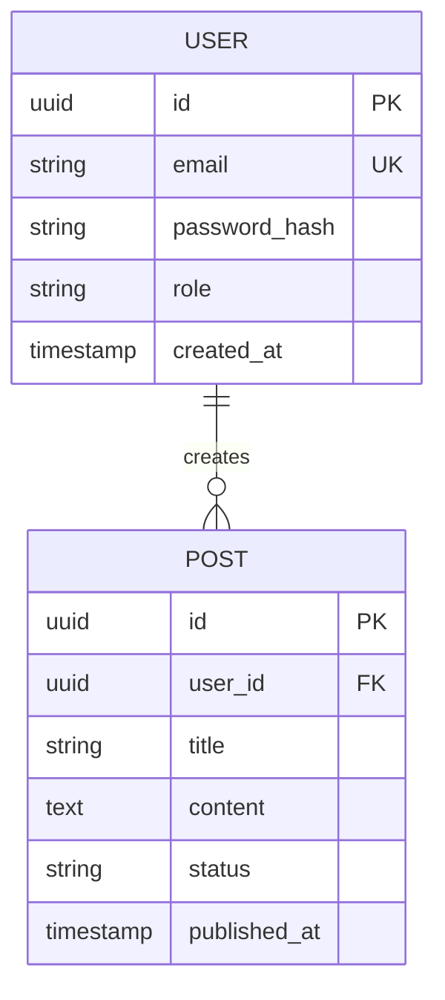

# Architecture and Engineering Plan: [Project Name]

> **Author**: 🏛️ Software Architect  
> **Creation Date**: YYYY-MM-DD  
> **Status**: [Proposal / Under Review / Approved for Development]  
> **Collaborators**: 🎨 WebDesigner, 🛠️ Junior Dev, 🚀 Senior Dev, 🛡️ Security Specialist

---

## 1. System Overview and Objectives
- **Core Objective**: [Concise description of the business problem and delivered value]
- **Target Audience**: [User profile and usage context]
- **Key Non-Functional Requirements**:
  - Availability / Resilience: [e.g., 99.9%, smooth failover]
  - Performance / Latency: [e.g., APIs < 150ms, green Core Web Vitals]
  - Scalability: [e.g., 10k concurrent users, stateless workers]

---

## 2. Selected Tech Stack and Rationale

| Layer | Chosen Technology | Version | Technical Rationale & Trade-offs |
| :--- | :--- | :--- | :--- |
| **Frontend** | [e.g.: React / Next.js / Vite] | [v...] | [Reason for choice over alternatives] |
| **Styling & UI** | [e.g.: Vanilla CSS with Tokens / Tailwind] | [v...] | [Alignment with modern identity and speed] |
| **Backend** | [e.g.: Node.js / Express / Fastify / NestJS / FastAPI] | [v...] | [I/O efficiency, maturity, and strict typing] |
| **Database** | [e.g.: PostgreSQL / SQLite / MongoDB] | [v...] | [ACID consistency, JSONB support, migrations] |
| **Cache / Messaging** | [e.g.: Redis / In-memory] | [v...] | [Session optimization and rate limiting] |
| **Authentication** | [e.g.: JWT with Refresh Tokens in HttpOnly Cookie] | - | [Security against XSS and CSRF] |

---

## 3. Data Architecture and Entity Modeling

### 3.1 Entity-Relationship Diagram (Mermaid)

### 3.2 Planned Migrations and Indexes
- `users`: Unique index on `email`, index on `created_at`.
- `posts`: Composite index `(user_id, status)`, full-text search index.

---

## 4. RESTful API Contracts (Endpoints)

Standardized Envelope:
- Success: `{ success: true, data: ..., meta?: ... }`
- Error: `{ success: false, error: { code, message, details? } }`

| Method | Endpoint | Minimum Role | Request Payload | Success Response (Status) | Mapped Errors |
| :--- | :--- | :--- | :--- | :--- | :--- |
| `POST` | `/api/v1/auth/register` | Public | `{ email, password, name }` | `201 Created` | `400, 409` |
| `POST` | `/api/v1/auth/login` | Public | `{ email, password }` | `200 OK` (Set-Cookie) | `400, 401` |
| `GET` | `/api/v1/posts` | Authenticated | Query: `page, limit, search` | `200 OK` + Meta | `401` |

---

## 5. Frontend, UI, and UX Guidelines (Approved with WebDesigner)

### 5.1 Visual Identity and Design Tokens
- Base file: `src/styles/design-tokens.css`
- Primary Palette:
  - Primary Background: `var(--bg-primary)` (#0B0F19)
  - Card Surface: `var(--bg-surface)` (#111827)
  - Accent: `var(--accent-primary)` (#6366F1)
- Typography: `Plus Jakarta Sans` or `Inter` via Google Fonts.

### 5.2 Mandatory Heuristics and States
- All forms feature inline validation and explicit states: `Default`, `Hover`, `Focus-visible`, `Loading`, `Error`.
- Shimmer skeletons enabled for table and list loading.
- Accessibility: Minimum 4.5:1 contrast (WCAG AA), keyboard navigable focus.

---

## 6. Task Plan and Responsibility Breakdown

### Phase 1: Foundation and Project Setup
- [ ] **TASK-01 [Dev Senior]**: Repository initialization, strict TypeScript configuration, linter, Docker/database, and folder structure (Clean Architecture).
  - *Files*: `package.json`, `tsconfig.json`, `.env.example`, `src/config/`.
  - *Acceptance Criteria*: Server starts and responds to `GET /health` with status 200.

### Phase 2: Visual Identity and Design Tokens
- [ ] **TASK-02 [WebDesigner]**: Creation of CSS tokens stylesheet, typography, and functional mockup of main screens.
  - *Files*: `src/styles/design-tokens.css`, `mockups/dashboard.html`.
  - *Acceptance Criteria*: Tokens integrated and validated against WCAG AA contrast.

### Phase 3: Data Layer and Models
- [ ] **TASK-03 [Dev Junior]**: Creation of database migration schemas and domain entities.
  - *Files*: `src/infrastructure/database/migrations/`, `src/domain/entities/`.
  - *Acceptance Criteria*: Migrations execute successfully (`up` and `down`) without errors.

### Phase 4: Authentication and Core Security
- [ ] **TASK-04 [Dev Senior]**: Implementation of password hashing service (Argon2id), JWT issuance and rotation, authentication middleware, and rate-limiting protection.
  - *Files*: `src/services/auth.service.ts`, `src/middlewares/auth.middleware.ts`.
  - *Acceptance Criteria*: Authentication tests pass with coverage > 90%.

### Phase 5: Standard Features (CRUD)
- [ ] **TASK-05 [Dev Junior]**: Implementation of Controllers, Zod Schemas, and Repositories for standard resources.
  - *Files*: `src/api/controllers/`, `src/schemas/`, `src/repositories/`.
  - *Acceptance Criteria*: Endpoints strictly respond according to the contracts in section 4.

### Phase 6: Frontend and Integration
- [ ] **TASK-06 [Dev Junior]**: Construction of UI components and screens consuming APIs with TanStack Query / Fetch.
  - *Files*: `src/components/`, `src/pages/`.
  - *Acceptance Criteria*: Responsive interface, loading states with skeletons, and visible error handling.

### Phase 7: Review, Optimization, and Final Validation
- [ ] **TASK-07 [Dev Senior]**: Cross-cutting code review, query optimization, performance refactoring, and load tests.
  - *Files*: Entire project.
  - *Acceptance Criteria*: Core Web Vitals approved and functional integrity verified.

### Phase 8: Security Quality Gate & OWASP Audit
- [ ] **TASK-08 [Security / Segurança]**: Static and dynamic code audit against OWASP Top 10 and Secure Coding. Generation of `security-plan.md` remediation plan if vulnerabilities exist, or issuance of final Security Sign-Off.
  - *Files*: Entire repository (`src/`, `.env.example`, dependencies).
  - *Acceptance Criteria*: Zero critical or high vulnerabilities pending; report issuance with "APPROVED" evaluation.
