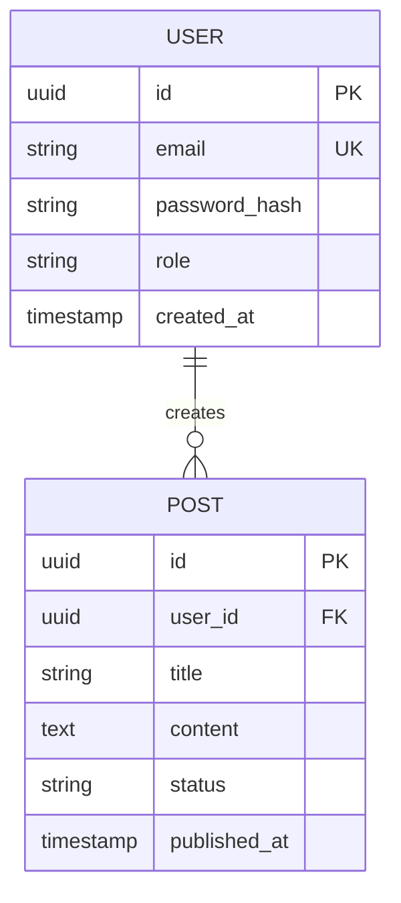

# Plano de Arquitetura e Engenharia: [Nome do Projeto]

> **Autor**: 🏛️ Arquiteto de Software  
> **Data de Criação**: YYYY-MM-DD  
> **Status**: [Proposta / Em Revisão / Aprovado para Desenvolvimento]  
> **Colaboradores**: 🎨 WebDesigner, 🛠️ Dev Junior, 🚀 Dev Senior, 🛡️ Especialista em Segurança

---

## 1. Visão Geral e Objetivos do Sistema
- **Objetivo Central**: [Descrição concisa do problema de negócio e valor entregue]
- **Público-Alvo**: [Perfil dos utilizadores e contexto de uso]
- **Requisitos Não-Funcionais Chave**:
  - Disponibilidade / Resiliência: [Ex: 99.9%, failover suave]
  - Desempenho / Latência: [Ex: APIs < 150ms, Core Web Vitals verdes]
  - Escalabilidade: [Ex: 10k utilizadores concorrentes, stateless workers]

---

## 2. Stack Tecnológica Selecionada e Justificativa

| Camada | Tecnologia Escolhida | Versão | Justificativa Técnica & Trade-offs |
| :--- | :--- | :--- | :--- |
| **Frontend** | [Ex: React / Next.js / Vite] | [v...] | [Motivo da escolha frente a alternativas] |
| **Estilização & UI** | [Ex: Vanilla CSS com Tokens / Tailwind] | [v...] | [Alinhamento com identidade moderna e velocidade] |
| **Backend** | [Ex: Node.js / Express / Fastify / NestJS / FastAPI] | [v...] | [Eficiência I/O, maturidade e tipagem estrita] |
| **Base de Dados** | [Ex: PostgreSQL / SQLite / MongoDB] | [v...] | [Consistência ACID, suporte a JSONB, migrações] |
| **Cache / Mensageria**| [Ex: Redis / In-memory] | [v...] | [Otimização de sessões e rate limiting] |
| **Autenticação** | [Ex: JWT com Refresh Tokens em HttpOnly Cookie] | - | [Segurança contra XSS e CSRF] |

---

## 3. Arquitetura de Dados e Modelagem de Entidades

### 3.1 Diagrama Entidade-Relacionamento (Mermaid)

### 3.2 Migrações e Índices Planeados
- `users`: Índice único em `email`, índice em `created_at`.
- `posts`: Índice composto `(user_id, status)`, índice de pesquisa textual.

---

## 4. Contratos de API RESTful (Endpoints)

Envelope Padronizado:
- Sucesso: `{ success: true, data: ..., meta?: ... }`
- Erro: `{ success: false, error: { code, message, details? } }`

| Método | Endpoint | Papel Mínimo | Payload Request | Resposta Sucesso (Status) | Erros Mapeados |
| :--- | :--- | :--- | :--- | :--- | :--- |
| `POST` | `/api/v1/auth/register` | Público | `{ email, password, name }` | `201 Created` | `400, 409` |
| `POST` | `/api/v1/auth/login` | Público | `{ email, password }` | `200 OK` (Set-Cookie) | `400, 401` |
| `GET` | `/api/v1/posts` | Autenticado | Query: `page, limit, search` | `200 OK` + Meta | `401` |

---

## 5. Diretrizes de Frontend, UI e UX (Aprovadas com WebDesigner)

### 5.1 Identidade Visual e Design Tokens
- Ficheiro base: `src/styles/design-tokens.css`
- Paleta Principal:
  - Fundo Primário: `var(--bg-primary)` (#0B0F19)
  - Superfície de Cartões: `var(--bg-surface)` (#111827)
  - Acento: `var(--accent-primary)` (#6366F1)
- Tipografia: `Plus Jakarta Sans` ou `Inter` via Google Fonts.

### 5.2 Heurísticas e Estados Obrigatórios
- Todos os formulários possuem validação inline e estados explícitos: `Default`, `Hover`, `Focus-visible`, `Loading`, `Error`.
- Skeletons com shimmer ativados para carregamento de tabelas e listas.
- Acessibilidade: Contraste mínimo 4.5:1 (WCAG AA), foco navegável por teclado.

---

## 6. Plano de Tarefas e Divisão de Responsabilidades

### Fase 1: Fundação e Setup do Projeto
- [ ] **TASK-01 [Dev Senior]**: Inicialização do repositório, configuração de TypeScript estrito, linter, Docker/banco e estrutura de pastas (Clean Architecture).
  - *Ficheiros*: `package.json`, `tsconfig.json`, `.env.example`, `src/config/`.
  - *Critério de Aceitação*: Servidor inicializa e responde a `GET /health` com status 200.

### Fase 2: Identidade Visual e Design Tokens
- [ ] **TASK-02 [WebDesigner]**: Criação da folha de tokens CSS, tipografia e mockup funcional dos ecrãs principais.
  - *Ficheiros*: `src/styles/design-tokens.css`, `mockups/dashboard.html`.
  - *Critério de Aceitação*: Tokens integrados e validados contra contraste WCAG AA.

### Fase 3: Camada de Dados e Modelos
- [ ] **TASK-03 [Dev Junior]**: Criação dos esquemas de migração da base de dados e entidades de domínio.
  - *Ficheiros*: `src/infrastructure/database/migrations/`, `src/domain/entities/`.
  - *Critério de Aceitação*: Migrações executam com sucesso (`up` e `down`) sem erros.

### Fase 4: Autenticação e Segurança Nuclear
- [ ] **TASK-04 [Dev Senior]**: Implementação do serviço de hash de senha (Argon2id), emissão e rotação de JWT, middleware de autenticação e proteção contra rate-limiting.
  - *Ficheiros*: `src/services/auth.service.ts`, `src/middlewares/auth.middleware.ts`.
  - *Critério de Aceitação*: Testes de autenticação aprovados com cobertura > 90%.

### Fase 5: Funcionalidades Padrão (CRUD)
- [ ] **TASK-05 [Dev Junior]**: Implementação dos Controllers, Schemas Zod e Repositórios para os recursos padrão.
  - *Ficheiros*: `src/api/controllers/`, `src/schemas/`, `src/repositories/`.
  - *Critério de Aceitação*: Endpoints respondem rigorosamente de acordo com os contratos da secção 4.

### Fase 6: Frontend e Integração
- [ ] **TASK-06 [Dev Junior]**: Construção dos componentes de UI e telas consumindo as APIs com TanStack Query / Fetch.
  - *Ficheiros*: `src/components/`, `src/pages/`.
  - *Critério de Aceitação*: Interface responsiva, estados de loading com skeletons e tratamento de erro visível.

### Fase 7: Revisão, Otimização e Validação Final
- [ ] **TASK-07 [Dev Senior]**: Code review transversal, otimização de queries, refatoração de performance e testes de carga.
  - *Ficheiros*: Todo o projeto.
  - *Critério de Aceitação*: Core Web Vitals aprovados e integridade funcional verificada.

### Fase 8: Security Quality Gate & Auditoria OWASP
- [ ] **TASK-08 [Segurança]**: Auditoria estática e dinâmica de código contra OWASP Top 10 e Secure Coding. Geração do plano de remediação `security-plan.md` se existirem vulnerabilidades, ou emissão do Security Sign-Off final.
  - *Ficheiros*: Todo o repositório (`src/`, `.env.example`, dependências).
  - *Critério de Aceitação*: Zero vulnerabilidades críticas ou altas pendentes; emissão do relatório com parecer "APROVADO".
