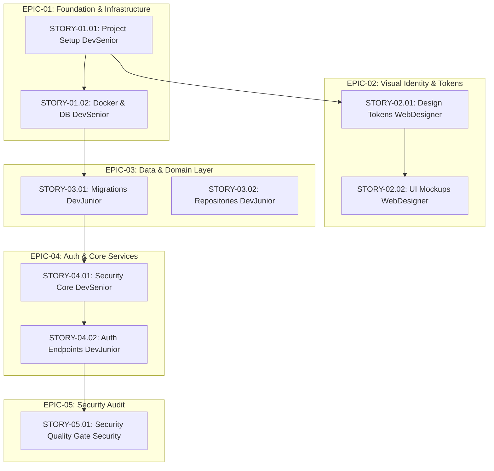

# Development Backlog & Tickets: [Project Name]

> **Author**: 🎫 Ticket Planner & Product Owner (`@TicketPlanner` / `@ProductOwner` / `@Tickets`)  
> **Source Blueprint**: [docs/architecture-plan.md](file:///docs/architecture-plan.md)  
> **Creation Date**: YYYY-MM-DD  
> **Status**: [Ready for Sprint / In Progress / Completed]  
> **Execution Roles**: 🛠️ Junior Dev, 🚀 Senior Dev, 🎨 WebDesigner, 🛡️ Security Specialist  

---

## 1. Backlog Executive Summary & Metrics

### 1.1 Metrics Overview

| Metric | Value |
| :--- | :--- |
| **Total Epics** | [e.g. 5] |
| **Total Stories** | [e.g. 18] |
| **Total Story Points** | [e.g. 54 SP] |
| **Assigned to `[Dev Senior]`** | [e.g. 7 Stories (26 SP)] |
| **Assigned to `[Dev Junior]`** | [e.g. 8 Stories (20 SP)] |
| **Assigned to `[WebDesigner]`** | [e.g. 2 Stories (5 SP)] |
| **Assigned to `[Security]`** | [e.g. 1 Story (3 SP)] |

### 1.2 Backlog Execution Flow & Dependencies (Mermaid)



---

## 2. Epics Catalog

### EPIC-01: [Epic Name, e.g.: Core Foundation & Infrastructure]
- **Goal**: [Clear summary of the business and technical value delivered by this Epic]
- **Architecture Reference**: Section 1 & Section 2 of `docs/architecture-plan.md`
- **Scope**:
  - **In-Scope**: [List of deliverables and capabilities included]
  - **Out-of-Scope**: [Explicit exclusions to prevent scope creep]
- **Child Stories**: `STORY-01.01`, `STORY-01.02`
- **Epic Definition of Done (DoD)**:
  - All child stories implemented and passed acceptance criteria.
  - Project builds and tests pass cleanly in CI/CD or local test suite.
  - Architecture conforms to blueprint specifications.

---

## 3. Development Stories Catalog

### STORY-01.01: [Actionable Title, e.g.: Repository Initialization and TypeScript Config]
- **Epic**: EPIC-01 - Core Foundation & Infrastructure
- **Type**: Technical Enabler
- **Assigned Agent**: `[Dev Senior]`
- **Priority**: P0 (Blocker)
- **Estimation**: 3 SP (Size: S)
- **Dependencies**:
  - Blocked by: None
  - Blocks: `STORY-01.02`, `STORY-03.01`

#### 1. Narrative
**As a** system engineer  
**I need** the base project initialized with strict TypeScript, ESLint, and modular folder structure  
**So that** developers can build application features on a standardized, type-safe foundation.

#### 2. Technical Context & Scope
- **Target Files**:
  - `package.json` (Create)
  - `tsconfig.json` (Create)
  - `.eslintrc.json` / `eslint.config.js` (Create)
  - `src/config/index.ts` (Create)
- **Key Guidelines**: Strict null checks enabled, path aliases configured (`@/`), layered folder structure (Controller, Service, Repository).

#### 3. Acceptance Criteria (BDD / Gherkin)
```gherkin
Scenario: Project compilation and typecheck
  Given the codebase is cloned and dependencies installed
  When the developer executes `npm run build` or `npm run typecheck`
  Then the TypeScript compiler completes with 0 errors
  And the distribution build is emitted cleanly in the output directory
```

#### 4. Verification Checklist
- [ ] Strict mode enabled in `tsconfig.json`.
- [ ] Lint scripts configured and passing without warnings.
- [ ] Environment variable validation utility established with Zod.
- [ ] `GET /health` endpoint configured responding with HTTP 200.

---

### STORY-01.02: [Actionable Title, e.g.: Relational Database Migration & Connection Setup]
- **Epic**: EPIC-01 - Core Foundation & Infrastructure
- **Type**: Technical Enabler
- **Assigned Agent**: `[Dev Senior]`
- **Priority**: P0 (Blocker)
- **Estimation**: 5 SP (Size: M)
- **Dependencies**:
  - Blocked by: `STORY-01.01`
  - Blocks: `STORY-03.01`

#### 1. Narrative
**As a** backend developer  
**I need** automated database connection pooling and migration orchestration  
**So that** persistent application data can be modeled with ACID integrity.

#### 2. Technical Context & Scope
- **Target Files**:
  - `src/infrastructure/database/connection.ts`
  - `docker-compose.yml`
  - `.env.example`
- **Database Engine**: PostgreSQL 16 (or SQLite for local lightweight mode).

#### 3. Acceptance Criteria (BDD / Gherkin)
```gherkin
Scenario: Successful database connectivity
  Given the database container is active
  When the application server boots up
  Then a pooled connection is established within 500ms
  And connection health is confirmed in the application logs
```

#### 4. Verification Checklist
- [ ] Connection pool handles reconnects and graceful shutdown.
- [ ] Docker compose file spins up the database container smoothly.
- [ ] Environment variables documented in `.env.example`.

---

*(Additional stories follow the same standardized structure...)*
